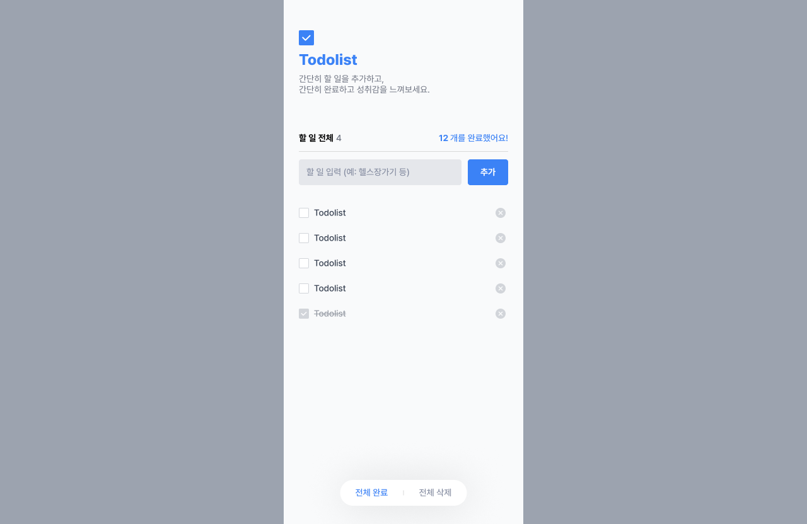
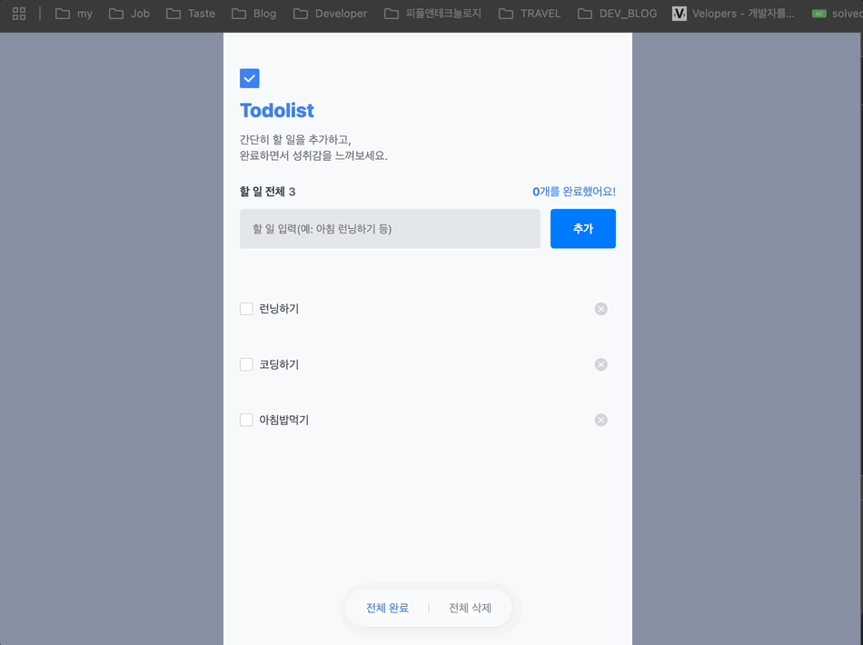
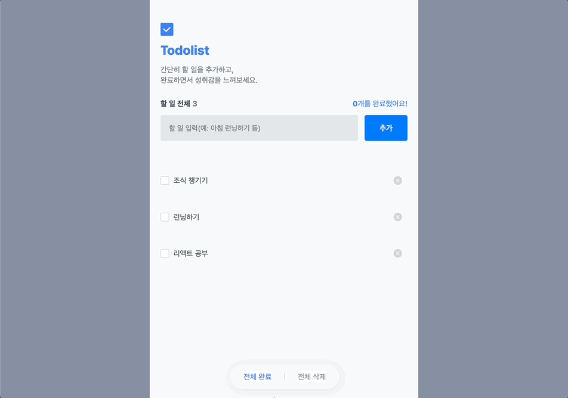
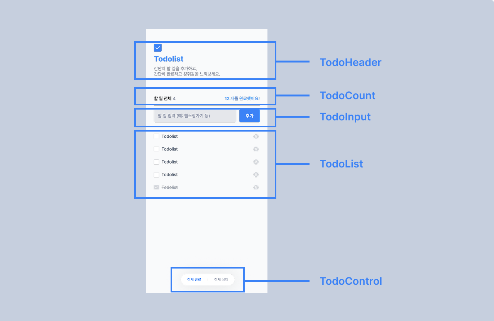

# Vanilla Javascript를 활용한 Todo List 구현

## 📌 프로젝트 개요

바닐라 JavaScript를 활용하여 구현한 할 일 관리(Todo List) 웹 애플리케이션입니다.<br />
할 일 관리 웹 애플리케이션 구현을 위해 아래 필수 및 부가 구현 사항들을 적용하고,<br />
기술 제약 사항에 맞게 구현했습니다.

<br />

## 🛠️ 설치 및 실행 방법

해당 프로젝트를 로컬 환경에서 실행하시려면 아래 방법으로 실행해주시면 됩니다.

### Live Server 실행 (VS Code)

1. **VS Code에서 프로젝트 열기**

   ```
   code todolist-js
   ```

<br />

2. **Live Server 확장 설치**

   - VS Code 확장 마켓플레이스에서 "Live Server" 검색 후 설치

<br />

3. **개발 서버 실행**

   - `index.html` 파일 우클릭 → "Open with Live Server" 선택
   - 또는 우하단 "Go Live" 버튼 클릭

<br />

4. **브라우저에서 확인**
   - `http://127.0.0.1:5500` 또는 `http://localhost:5500`으로 자동 이동

<br />
<br />

## ✅ 필수 구현 사항

### 목업 이미지

목업 이미지는 피그마로 구현해, 디자인을 참고해 작업했습니다.




### 0) 기본 구현 사항

- [x] boilerplate 내의 코드 구조 내에서 코드 작성하며, 페이지 레이아웃은 UX를 고려하여 자유롭게 구현합니다.
- [x] 코드의 상단부터 변수 및 각종 초기화 설정(init), 함수작성, 실행(render) 순으로 작성합니다.
- [x] TodoList를 비롯한 컴포넌트 함수는 App.js에서 받은 파라미터로 부터 관리되게 구현합니다.

### 1) 할 일 관리(추가 및 삭제)



- [x] **할 일 추가**: 새로운 할 일을 입력하여 목록에 추가할 수 있습니다. (추가 버튼 클릭 혹은 엔터키)
- [x] **할 일 삭제**: 불필요한 할 일을 목록에서 제거할 수 있습니다. (목록 내 삭제 버튼 클릭)

### 2) 할 일 관리(수정 및 완료 처리)



- [x] **할 일 수정**: 기존 할 일의 내용을 수정할 수 있습니다. (목록 내 체크박스 버튼 클릭)
- [x] **할 일 수정(부가 기능)**: 할 일 완료 상태에서는 수정이 불가능하고(read-only) 미완료 시에는 수정이 가능합니다.
- [x] **완료 상태 토글**: 할 일의 완료/미완료 상태를 변경할 수 있습니다. (목록 내 제목 클릭)

### 3) 할 일 상태 관련 기능(일괄 관리 및 갯수)


- [x] **전체 완료**: 모든 할 일을 한 번에 완료 처리할 수 있습니다.
- [x] **전체 삭제**: 모든 할 일을 한 번에 삭제할 수 있습니다.
- [x] **전체 할 일 수**: 등록된 모든 할 일의 개수를 표시합니다.
- [x] **완료된 할 일 수**: 완료 처리된 할 일의 개수를 표시합니다.

### 4) 데이터 지속성

- [x] **로컬 스토리지**: 브라우저를 닫아도 할 일 데이터가 유지됩니다.
- [x] **실시간 저장**: 할 일 추가/수정/삭제 시 즉시 저장됩니다.

### 5) 유효성 검사(추가 구현 사항)

- [x] **길이 제한**: 할 일은 1자 이상 50자 이하로 입력해야 합니다.
- [x] **실시간 에러 표시**: 유효하지 않은 입력 시 에러 메시지가 표시됩니다.
- [x] **사용자 경험 개선**: 입력 중 에러 메시지가 자동으로 숨겨집니다.

<br />
<br />

## 📁 디렉토리 구조

프로젝트의 디렉토리 구조는 다음과 같습니다.<br />
컴포넌트 기준으로 나눠져 있으며, 각 기능별로 모듈화되어 있습니다.

```
todolist-js/
├── /assets
│   ├── checkbox_completed.svg
│   ├── checkbox.svg
│   ├── delete.svg
│   ├── logo.svg
│   ├── more.svg
│   └── no_todo.webp
│
├── /components
│   ├── TodoControls.js      # 전체 완료/삭제 버튼
│   ├── TodoCount.js         # 할 일 개수 표시
│   ├── TodoHeader.js        # 헤더 컴포넌트
│   ├── TodoInput.js         # 할 일 입력/수정
│   └── TodoList.js          # 할 일 목록 표시
│
├── /model
│   └── model.js             # 데이터 모델 정의
│
├── /styles
│   ├── app.css              # 메인 스타일
│   ├── global.css           # 전역 스타일
│   └── index.css            # 기본 스타일
│
├── /utils
│   └── getTodoInputError.js # 입력 유효성 검사
│
├── App.js                   # 메인 애플리케이션
├── createStore.js           # 상태 관리 스토어
├── index.html               # HTML 엔트리 포인트
└── index.js                 # JavaScript 엔트리 포인트
```

### 주요 디렉토리 및 파일 설명

- **assets**: SVG 아이콘과 이미지 등 정적 자산을 포함합니다.
- **components**: 재사용 가능한 UI 컴포넌트들로 구성되어 있습니다.

  - `TodoInput`: 할 일 입력과 수정을 담당하는 컴포넌트
  - `TodoList`: 할 일 목록을 렌더링하는 컴포넌트
  - `TodoCount`: 할 일 통계를 표시하는 컴포넌트
  - `TodoControls`: 일괄 관리 기능을 제공하는 컴포넌트

- **model**: 애플리케이션의 데이터 모델을 정의합니다.
- **styles**: CSS 스타일 파일들을 포함합니다.
- **utils**: 유틸리티 함수를 포함합니다.

<br />
<br />

## 🏛️ 컴포넌트 구조



```
App
├── TodoHeader
├── TodoCount
├── TodoInput
├── TodoList
└── TodoControls
```

- `TodoHeader`: 제목과 로고를 표시합니다.
- `TodoCount`: 전체 할 일 수와 완료된 할 일 수를 표시합니다.
- `TodoInput`: 새로운 할 일 추가와 기존 할 일 수정을 담당합니다.
- `TodoList`: 할 일 목록을 렌더링하고 개별 할 일의 상태 관리를 합니다.
- `TodoControls`: 전체 완료, 전체 삭제 등의 일괄 관리 기능을 제공합니다.

<br />
<br />

## 🔧 기술 스택

### 상태 관리

- **Custom Store**: 간단한 상태 관리 패턴 구현
- **Local Storage**: 브라우저 로컬 스토리지를 활용한 데이터 지속성

### 아키텍처 패턴

- **컴포넌트 기반 설계**: 재사용 가능한 컴포넌트 구조
- **Pub/sub 패턴**: 상태 변경 시 컴포넌트 자동 업데이트
- **모듈 시스템**: ES6 모듈을 활용한 코드 분리

<br />
<br />

## ✨ 기술적 챌린지: 전역 상태 관리를 위한 Pub/Sub 패턴 적용

### 1) 왜 상태 관리가 필요했을까?

과제를 진행하며 다음과 같은 다양한 상태 변화에 따른 관리가 필요했습니다.

- 할 일 데이터의 생성, 수정, 삭제
- 완료 여부에 따른 렌더링 UI 변경
- 현재 수정 중인 Todo 항목의 상태 유지
- 전체 Todo 개수 및 완료 개수 실시간 반영
- 상태 변경 시 즉각적인 localStorage 반영

로컬 상태나 DOM 조작만으로는 관리가 어려운 부분이 있어, 과제를 진행하면서도 막히는 부분이 많았습니다.<br /> 컴포넌트 간 상태 공유 및 변화 감지를 위해 구조적인 설계가 필요했고 React의 useState, Redux의 dispatch → reducer → subscribe 흐름이 떠올라 아래 패턴을 적용하게 되었습니다.

<br />

### 2) Pub/Sub 패턴 개념 및 도입 이유

이번 과제에서는 이를 해결하기 위해 `Publish/Subscribe(발행/구독)` 패턴 기반의 전역 상태 관리 시스템을 직접 구현하였습니다.

> Publisher(발행자): 상태를 변경하는 주체 (예: 할 일을 추가하는 컴포넌트)<br />
> Subscriber(구독자): 상태 변경을 감지하고 이에 반응하는 주체 (예: 리스트 렌더링, 카운터 컴포넌트 등)

<br />

### 3) 구현 방식 (createStore.js)

```js
function createStore() {
  const localStorage = window.localStorage;
  const todos = localStorage.getItem("todo");
  let data = JSON.parse(todos) ?? { todos: {}, editingTodo: null };
  const listeners = [];

  return {
    getState: () => {
      return {
        ...data,
        todos: { ...(data.todos || {}) },
      };
    },
    setState: (newState) => {
      data = { ...data, ...newState };
      localStorage.setItem("todo", JSON.stringify(data));
      listeners.forEach((listener) => listener());
    },
    subscribe: (func) => {
      listeners.push(func);
    },
  };
}

export default createStore;
```

- `getState()`: 현재 상태를 읽기 위한 getter
- `setState(nextState)`: 새로운 상태로 변경 + localStorage 저장
- `subscribe(listener)`: 상태 변경에 반응할 리스너 등록 (컴포넌트별 렌더링 로직)

<br />

### 4) 실제 적용 예시

- `TodoList.js`: store를 구독하여 todos 상태가 변경되면 자동으로 리스트를 리렌더링
- `TodoCounter.js`: 전체 개수와 완료된 개수 계산을 위해 상태 변화 구독
- `TodoInput.js`: 선택된 할 일을 수정할 때 editingTodo 상태에 따라 인풋값을 바인딩

각각 컴포넌트는 전역 상태에 직접 의존하지 않고, store가 상태를 발행(publish)하면 자동으로 반응하도록 설계했습니다.

직접 전역 상태 관리 흐름을 설계해보며, 단순한 기술 구현을 넘어서 컴포넌트 간의 책임 분리, 메시지 흐름 설계, 리렌더링 최적화 같은 문제들을 주체적으로 고민하고 해결해볼 수 있었습니다.

<br />
<br />

## Convention

### 1) `Commit Convention`

| 커밋 유형 | 의미                                                         |
| --------- | ------------------------------------------------------------ |
| feat:     | 새로운 기능 추가                                             |
| fix :     | 버그 수정                                                    |
| docs:     | 문서 수정                                                    |
| typo:     | 코드 formatting, 세미콜론 누락, 코드 자체의 변경이 없는 경우 |
| refactor: | 코드 리팩토링                                                |
| Style:    | CSS 등 사용자 UI 디자인 변경                                 |
| Rename:   | 파일 또는 폴더 명을 수정하거나 옮기는 작업만인 경우          |
| Remove:   | 파일을 삭제하는 작업만 수행한 경우                           |

<br />

### 2) CSS Convention

CSS는 아래 CSS 스타일 컨벤션을 표준으로 삼고 코드를 작성했습니다.<br />
CSS 컨벤션 : [idiomatic-css](https://github.com/necolas/idiomatic-css)

<br />
<br />

## 회고

처음에는 단순한 할 일 관리 앱 구현으로만 생각했지만, 상태 변화에 따른 UI 렌더링, 컴포넌트 간 데이터 흐름 등을 고민하면서 생각보다 훨씬 많은 설계 요소들이 필요하다는 것을 느끼고, 중간에 작업을 뒤엎고 다시 상태 저장 로직을 고민했었습니다.

과제에서 가장 많은 고민을 했던 부분은 단연 상태 관리였는데,

- Todo의 목록 데이터와 선택된 editingTodo
- 각각의 컴포넌트들이 어떤 시점에 어떻게 렌더링되어야 하는지
- 수정, 삭제, 완료 등의 상태 변화가 전체 앱에 어떻게 영향을 미칠지

React의 상태 관리 흐름이나, Redux의 Store, Dispatch, Subscribe 개념을 떠올리면서 제가 그동안 당연스레 받아들였던 로직들이 실제로는 어떤 구조와 흐름으로 구현되는지 이해할 수 있었던 과제라 재밌게 진행했습니다 :)

단순히 프레임워크를 “사용하는” 개발자가 아닌,프레임워크의 내부 동작을 “이해하고 설계할 수 있는” 개발자가 되기 위해 더 깊이 공부해야겠다 자극 받는 계기가 되었습니다.
감사합니다 🙇‍♀️
